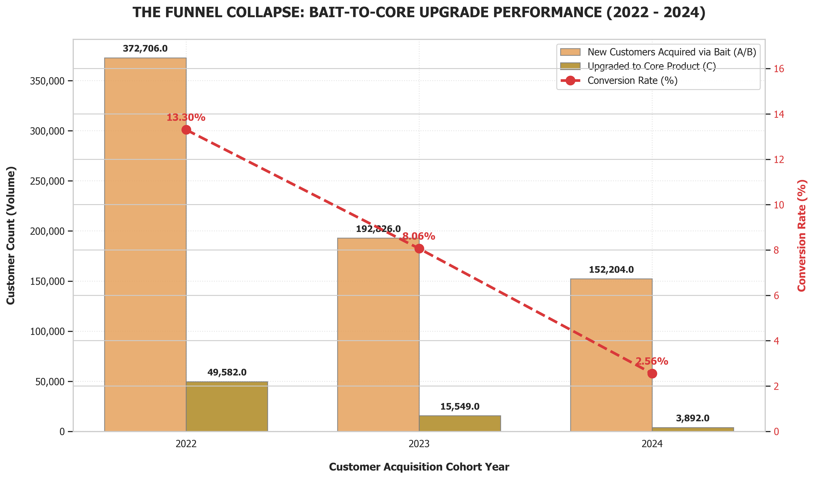
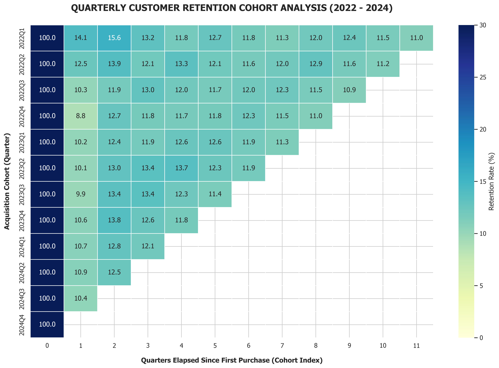
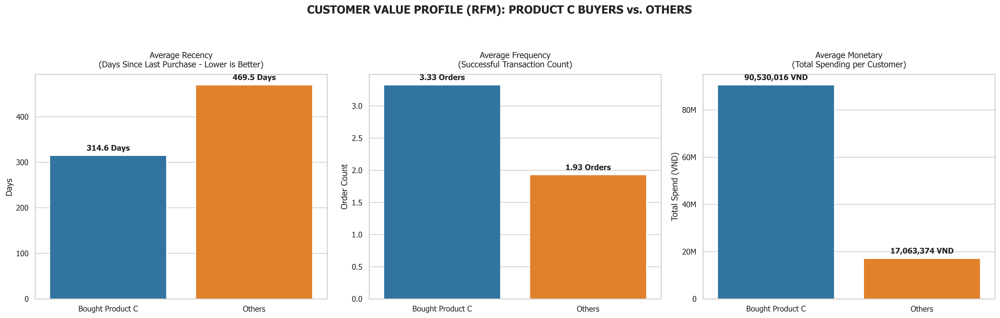
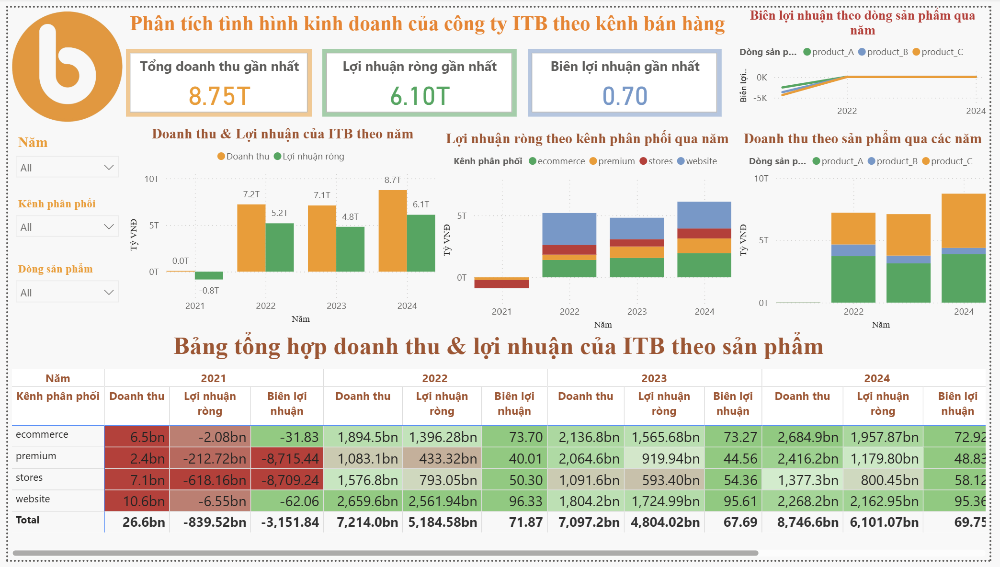
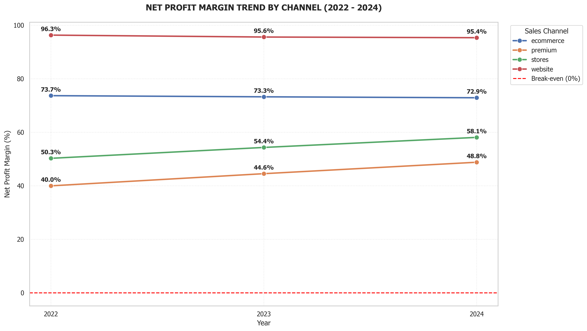
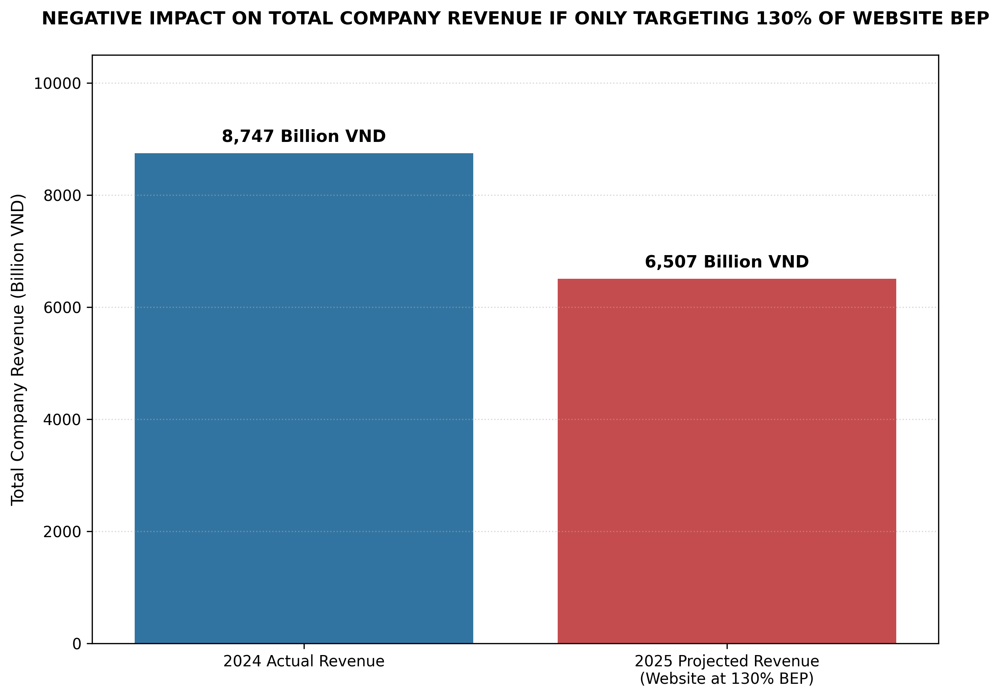
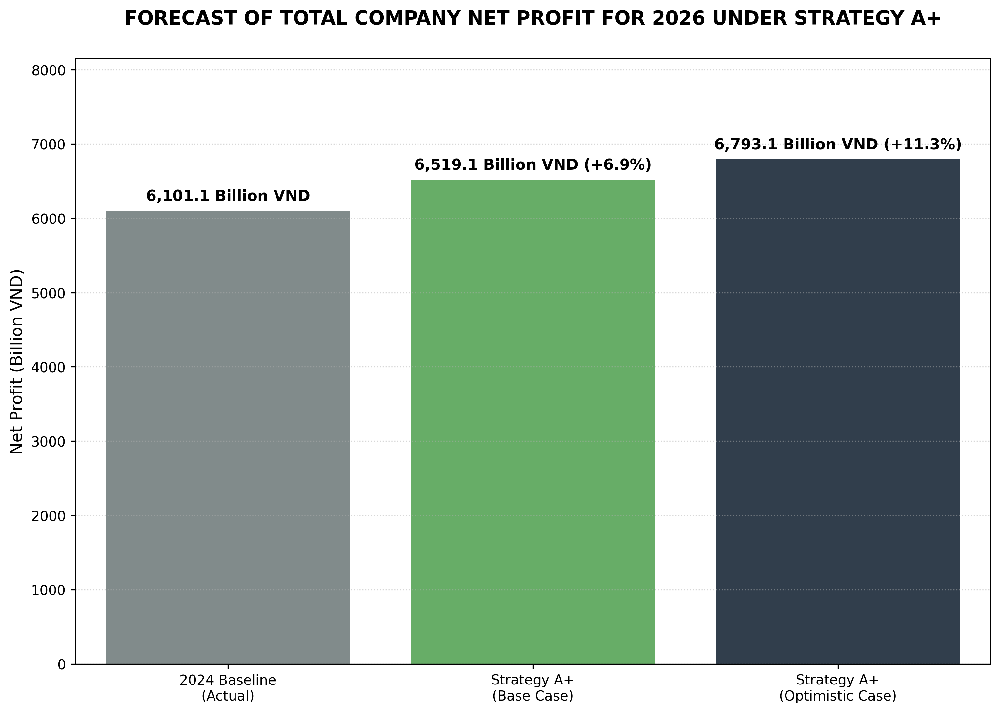

# ITB Commercial Performance & Strategic Growth Analytics
*End-to-End Business Intelligence, Star Schema Modeling & Financial Simulation — BI9 Competition (Rounds 2 & 3)*

---

## 1. Business Problem & Context

**ITB** is a Vietnamese commercial distributor operating across multiple consumer product lines. Despite consistent top-line revenue growth, the company's executive board identified a structural performance anomaly: revenue expansion was accompanied by customer base contraction — indicative of increasing average transaction value from a shrinking, non-recurring customer pool rather than genuine growth.

ITB's historical acquisition model relied on low-margin Products A & B as customer entry points, with the expectation that acquired customers would subsequently upgrade to the premium Product C. This project audits the empirical validity of that model and develops forward-looking financial recommendations.

**Analytical Objectives:**

1. Evaluate the conversion efficiency of the A/B → C funnel using longitudinal cohort data.
2. Quantify customer retention through quarterly cohort analysis and 90-day churn measurement.
3. Construct a normalized Star Schema Data Warehouse for BI tool ingestion.
4. Model 2025 Website cost re-structuring (BEP) and 2026 strategic capital reallocation scenarios.

> 📄 Official competition prompts: [Round 02 Requirements](docs/bi9-round2-requirements.pdf) | [Round 03 Requirements](docs/bi9-round3-requirements.pdf)

---

## 2. Analytical Framework & Technology Stack

**Pipeline:**

```
Raw Transactions (5 parts) → ETL & Cleaning → Diagnostic Analytics → Star Schema Modeling → Financial Simulations
```

| Layer | Notebook | Scope |
|-------|----------|-------|
| Data Engineering | `01_etl_data_pipeline.ipynb` | Ingestion, cleaning, master dataset export |
| Diagnostic Analytics | `02_diagnostic_business_analytics.ipynb` | Funnel, retention, RFM, channel profitability |
| Schema Modeling | `03_star_schema_data_modeling.ipynb` | Star Schema construction & CSV export |
| Financial Modeling | `04_strategic_financial_simulations.ipynb` | BEP (2025), scenario simulations (2026) |

**Environment:** VS Code (Jupyter Extension) | **Stack:** Python (`pandas`, `numpy`, `matplotlib`, `seaborn`) · Power BI

---

## 3. Data Engineering & ETL Pipeline

**Source:** 2,107,643 raw transaction records across 5 partitioned CSV files. **`01_etl_data_pipeline.ipynb`** produces a clean analytical master dataset of **2,049,263 records** (2022–2024) through the following operations:

1. **Type parsing:** `order_date` and `dob` converted to `datetime64[ns]`.
2. **Categorical normalization:** Redundant education labels consolidated; missing categorical values imputed as `Unknown`.
3. **Referential integrity enforcement:** 56,435 orphan transaction records (referencing non-existent customer IDs) removed.
4. **Temporal scope filter:** Year 2021 excluded — single-day coverage would bias YoY trend analysis.

---

## 4. Diagnostic Analytics

### 4.1. Revenue vs. Customer Base Divergence

Revenue grew 21.2% from 2022 to 2024 while the active customer base contracted 10.6% in 2023, confirming that top-line growth was driven by higher average transaction value rather than customer base expansion.

| Year | Revenue (VND) | Gross Profit (VND) | Active Customers | Customer YoY Δ |
| :---: | :---: | :---: | :---: | :---: |
| 2022 | 7,213,973,112,382 | 698,891,680,305 | 406,738 | Baseline |
| 2023 | 7,097,189,459,768 | 782,153,968,986 | 363,732 | −10.57% |
| 2024 | 8,746,644,109,265 | 760,291,970,111 | 383,421 | +5.41% |

### 4.2. Loss-Leader Funnel Conversion

New customer acquisition via Products A & B declined 59% over the period, while the A/B → C conversion rate collapsed from **13.30% (2022)** to **2.56% (2024)**, indicating concurrent top-of-funnel shrinkage and mid-funnel leakage.

<p align="center">
  
</p>
<p align="center"><i>Figure 1: A/B acquisition volume and A/B → C conversion rate trend (2022–2024)</i></p>

### 4.3. Customer Retention

Overall 90-day churn rate: **85.01%**. Cohort analysis confirms 86%–91% of customers do not return after their first purchase quarter, across all acquisition cohorts.

<p align="center">
  
</p>
<p align="center"><i>Figure 2: Quarterly cohort retention heatmap (2022–2024)</i></p>

---

## 5. Customer Value Segmentation (RFM)

Customers segmented by Product C purchase history. Product C buyers exhibit significantly superior RFM metrics across all three dimensions:

| RFM Dimension | Product C Buyers | Others | Ratio |
| :---: | :---: | :---: | :---: |
| Recency (days) | 314.6 | 469.8 | −33% |
| Frequency (orders) | 3.33 | 1.93 | +73% |
| Monetary (VND) | 90,530,016 | 17,063,374 | +430% |

<p align="center">
  
</p>
<p align="center"><i>Figure 3: RFM comparison — Product C buyers vs. non-C buyers</i></p>

---

## 6. Star Schema Data Warehouse

**`03_star_schema_data_modeling.ipynb`** transforms the flat master dataset into a Star Schema comprising 1 Fact table and 6 Dimension tables, exported to `data/processed/` as UTF-8-BOM CSVs.

```
             [dim_customer]        [dim_product]
            (customer_key)          (product_key)
                   │                     │
                   └──► [fact_order] ◄───┘
                   ┌──►   (Central)  ◄───┐
                   │                     │
             [dim_stores]          [dim_channel]
             (store_key)           (channel_key)
                   │                     │
                   ▼                     ▼
              [dim_date]      [dim_order_status]
              (date_key)      (order_status_key)
```

Surrogate keys replace natural business keys throughout. Online transactions retain `NULL` `store_key` by design. See [`data_dictionary.md`](data_dictionary.md) for full schema specification.

---

## 7. Power BI Dashboard

An interactive executive dashboard monitors core KPIs: revenue, net profit, channel margins, and product mix.



### Channel Profitability Analysis

Physical channels (Stores, Premium) bear a shared retail headcount cost of 838.6 B VND/year, compressing net profit margins to 48.8%–58.1%. Digital channels (Website: **95.4%**, Ecommerce: **73.3%**) operate with substantially lower cost structures.

<p align="center">
  
</p>
<p align="center"><i>Figure 4: Net profit margin by channel (2022–2024)</i></p>

---

## 8. Strategic Financial Simulations

### 8.1. Website BEP Analysis (2025)

Under the 2025 cost structure (Fixed: 20.7 B VND/year; Variable: payment gateway 2%, shipping, email acquisition cost):

| Metric | Value |
| :--- | :--- |
| Avg. Contribution Margin / Order | 10,648,159 VND |
| Break-even Volume | 1,944 orders/year |
| 2024 Actual Website Volume | 186,342 orders/year |

Setting a 130% BEP ceiling as a growth target would constrain Website volume to 2,527 orders — a **−98.6% reduction** from 2024 actuals — producing a **−25.61% corporate revenue contraction**.

<p align="center">
  
</p>
<p align="center"><i>Figure 5: Corporate revenue impact if Website is constrained to 130% BEP (2025)</i></p>

### 8.2. Strategy A+ Scenario Simulations (2026)

Strategy A+ models the financial impact of phasing out Product B, rationalizing physical store footprint, renegotiating partner commissions, and reinvesting freed capital into Website digital marketing.

| Scenario | 2026 Net Profit | YoY Change |
| :--- | :---: | :---: |
| 2024 Baseline | 6,101 B VND | — |
| A+ Base Case (ROAS 5:1) | 6,519 B VND | **+6.85%** |
| A+ Optimistic Case (ROAS 6:1) | 6,793 B VND | **+11.34%** |

<p align="center">
  
</p>
<p align="center"><i>Figure 6: 2026 projected net profit under Strategy A+ scenarios</i></p>

---

## 9. Strategic Recommendations

1. **Discontinue the loss-leader acquisition model.** Product B should be phased out; Product A transitioned to a self-sustaining margin contributor rather than an acquisition subsidy.
2. **Reallocate capital from physical to digital channels.** Redirect store fixed-cost savings into Website marketing to leverage the channel's 95%+ net profit margin.
3. **Implement a Product C-focused CRM program.** Direct retention investment toward the high-LTV Product C segment to reduce structural churn.

---

## 10. Repository Structure

```
BI9-R2-R3-ITB-Analytics/
├── assets/
│   ├── charts/                 # Exported matplotlib/seaborn charts
│   └── dashboards/             # Power BI dashboard screenshots
├── data/                       # Local data (excluded from Git)
│   ├── raw/                    # Source CSV files
│   └── processed/              # Cleaned master & Star Schema exports
├── docs/                       # Competition guidelines
├── notebooks/
│   ├── 01_etl_data_pipeline.ipynb
│   ├── 02_diagnostic_business_analytics.ipynb
│   ├── 03_star_schema_data_modeling.ipynb
│   └── 04_strategic_financial_simulations.ipynb
├── requirements.txt
├── data_dictionary.md
└── README.md
```